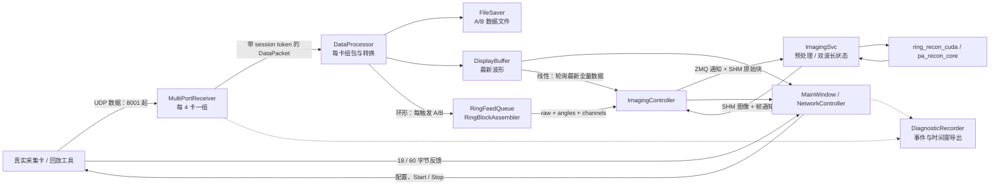

# PAErealtimeImaging 架构与源码审核报告

审核日期：2026-09-09（北京时间）  
审核对象：GitHub 仓库 ZiXuannnZhang/PAErealtimeImaging 的 main 与最新实现分支。

## 1. 审核结论

项目已经形成“多卡 UDP 采集 → 单卡组包 → 存储/显示/成像分发 → 独立 GPU 服务”的架构，环形成像的数据馈送也已从界面刷新中分离。这些基础值得保留。最新分支明显加强了启动事务、接收端会话准入、StartFence 和诊断证据，方向合理。

当前最需要处理的是**数据正确性与保存一致性**：共享内存覆盖后仍参与重建、首包乱序引起采样错位、丢触发后波长/角度失去位置，以及保存线程跨线程访问文件对象。双波长跨块状态还存在一个在第三块出现的确定性错误。建议先修这些问题，再优化吞吐和拆分大类。

本次列出 **7 项 P1、6 项 P2、1 项 P3**。没有把尚未实测的性能推断列为已发生的故障，也没有确认必须立即停用系统的 P0。现有测试经运行环境修正和失败项复查后，main 的 8 项、最新分支的 14 项全部通过；新增组件复现仍能暴露现有测试没有覆盖的缺陷。

### 1.1 版本与审核边界

| 项目 | main | 最新实现分支 |
|---|---|---|
| 分支 | main | codex/session-boundary-log-window-20260908 |
| 固定提交 | 3c7904da9b9ec2e96aef384081ac04fc88d7fb29 | e66a29bfbbaa6534911a23d48e8624fb8d552bec |
| 头提交时间（北京时间） | 2026-09-07 22:55:08 | 2026-09-08 22:56:26 |
| 关系 | canonical 基线 | 领先 23 个提交，落后 0 个提交 |
| 跟踪文件数量 | 184 | 198 |
| 本次保存的审核输入文件 | 119 | 129 |

“最新”按读取到的全部 **15 个远程分支的头提交 committer 时间**排序确定，不按分支名称日期猜测。最新头提交是文档提交；其前一个实现提交为 e6862d5e43bddc50700369ef003dc4ab4f40d37e。相对 main 的差异涉及 37 个文件，新增 6,385 行、删除 192 行，包含测试和执行回执，不能把这些全部计为业务代码增长。

审核输入通过 GitHub 连接器按固定提交获取。SSH/HTTPS 克隆未成功，因此没有使用本地 master 或未提交工作区来替代远程源码。保存的 248 份审核输入均已与远程 Git blob SHA-1 校验一致；包括两个分支间相同文件的重复快照。大型第三方绘图库、二进制依赖及大部分历史回执只做树清单/依赖检查，不作逐行内部审核。

主要审查 C++/Qt 采集、组包、存储、IPC、GPU 服务调度和 CUDA 源码；同时阅读模拟器、CPU/MATLAB 参考及半径标定入口。未运行真实采集卡、CUDA 重建、MATLAB、磁盘故障注入或长期负载测试。对物理采集质量、实际峰值吞吐和图像精度不作本次已验收结论。

版本与源码依据：[远程分支头记录](D:/ChatGPT/PAERealtimeImaging/CODEX_REPORTS/architecture-audit-20260909/branch-heads.json)、[源码树与分支差异清单](D:/ChatGPT/PAERealtimeImaging/CODEX_REPORTS/architecture-audit-20260909/source-manifest.json)、[逐文件 Git blob 校验](D:/ChatGPT/PAERealtimeImaging/CODEX_REPORTS/architecture-audit-20260909/source-hash-verification.json)。

## 2. 架构总结

### 2.1 主要组件及职责

| 组件 | 主要职责 | 执行位置与交互 |
|---|---|---|
| MainWindow | 界面、参数、启动/停止、自动保存会话、线性/环形馈送、图像展示 | Qt 主线程，并直接拥有环形工作线程和回调 |
| NetworkController | 扫描/目标卡、控制报文、18/60 字节反馈、配置确认、线程生命周期、统计 | 主线程协调，另有反馈与停止相关后台任务 |
| MeasurementSessionTransaction（最新新增） | Prepare → Arm → 逐卡 StartFence/发送 → 成功或回滚 | 同步执行回调；控制器对接接收线程与处理线程 |
| MultiPortReceiver | 每 4 卡一组 WinSock select/recvfrom；解析 4 字节头；会话准入 | 专用接收线程，逐卡投入 ConcurrentQueue |
| DataProcessor / PacketAssemblyBuffer | 每卡组包、16/32 位转 float、缺包统计、显示采样及多路分发 | 每卡一个 QThread |
| FileSaver | 每卡 A/B 文件、float16 转换、批量写盘、文件轮换 | 每卡一个 QThread；当前控制调用存在跨线程文件访问 |
| DisplayBuffer | 波形最新帧与全分辨率快照 | 加锁交换/复制；波形允许跳帧 |
| FramePublisher（可选） | 按 triggerSeq 聚合多卡、向扩展进程发布 | 独立线程，超时清理；不是环形重建主链路 |
| RingBlockAssembler | 8 个物理通道按触发聚合、形成 raw/angles/channels 块 | MainWindow 所有的环形馈送线程 |
| ImagingController | 服务进程、ZMQ 控制、共享内存、环形显示双缓冲 | 主进程；部分环形快照复制在 worker |
| ImagingSvc | 接收配置/块通知、预处理、双波长划分、CUDA 增量重建 | 独立 Qt 子进程，CPU 预处理与 GPU 调用串行推进 |
| ring_recon / ring_recon_cuda | CPU 参考、预处理及 CUDA DAS/半径/扇区计算 | 普通 C++ 与单独 CUDA DLL；线性另依赖 pa_recon_core |
| DiagnosticRecorder / NetworkDiagnostics | 运行事件、网络快照、时间窗导出与证据包 | 后台记录/导出与控制器采样 |
| PALiveImagingSimSender / RingUdpReplay | 卡反馈模拟、UDP 回放 | 独立验收工具 |
| RadiusCalibration / 实时重建脚本 | 扫描半径/角度标定与 MATLAB 数值参考 | 离线工具，参数经配置进入实时链路 |

依据：[接收与工作线程创建](D:/ChatGPT/PAERealtimeImaging/CODEX_REPORTS/architecture-audit-20260909/latest/MC_410T_MultiCard/delivery/src/NetworkController.cpp:400)、[单卡分发](D:/ChatGPT/PAERealtimeImaging/CODEX_REPORTS/architecture-audit-20260909/latest/MC_410T_MultiCard/delivery/src/DataProcessor.cpp:461)、[环形馈送线程](D:/ChatGPT/PAERealtimeImaging/CODEX_REPORTS/architecture-audit-20260909/latest/MC_410T_MultiCard/delivery/src/MainWindow.cpp:4479)、[服务端重建](D:/ChatGPT/PAERealtimeImaging/CODEX_REPORTS/architecture-audit-20260909/latest/MC_410T_MultiCard/delivery/src/ImagingSvc/ImagingSvc.cpp:547)。

### 2.2 主要数据流

控制流与数据流已经初步分离，但“原始数据是否完整”和“显示是否可以跳帧”尚未形成贯穿各层的共同契约。接收端最新增加的 measurementSessionToken 到 TriggerGroup、环形块、GPU 输入和持久化文件没有作为同一个不可变身份持续传递；自动保存另有 sessionGen，环形侧又以本地计数推导角度与波长。

**波形与显示快照可以采用只保留最新帧的策略；用于重建积分和研究数据保存的输入必须显式记录缺失，不能把跳过、覆盖或补零后的数据继续当作完整连续采集。**这是本报告各项问题的共同修复方向。

### 2.3 最新分支的进展与残余边界

最新分支将接收端状态划分为 Preparing、Armed、StartFenceHold、Running 等阶段，逐卡建立 HOLD 后发送 Start，成功后才开放该卡准入；配合 DataProcessor barrier，改善旧队列/旧 socket 数据混入新测量的问题。MeasurementSessionTransaction 也使成功、失败、回滚有了可检查的步骤记录。它保留了 main 上已有的批处理边界修复和 RingBlockAssembler 安全加固。

这些变化主要解决**开始/停止边界**，没有解决测量期间的乱序、丢触发、SHM 覆盖和文件写入一致性。Start 发送成功也是主机端 send 成功，不等于本次审核已证明硬件执行成功或多卡物理触发同步。源码依据：[事务步骤](D:/ChatGPT/PAERealtimeImaging/CODEX_REPORTS/architecture-audit-20260909/latest/MC_410T_MultiCard/delivery/src/MeasurementSession.cpp:3)、[接收端 StartFence](D:/ChatGPT/PAERealtimeImaging/CODEX_REPORTS/architecture-audit-20260909/latest/MC_410T_MultiCard/delivery/src/MultiPortReceiver.cpp:258)。

## 3. 按优先级排列的问题

优先级：P1＝建议在下一次正式采集/发布前处理的数据正确性或稳定性缺陷；P2＝吞吐、结构、跨设备维护风险；P3＝低影响边界问题。证据分为“实际组件复现”“源码路径确认”“待现场测量”。除 R13 外，以下问题在 main 与最新分支均存在。

| 编号 | 级别 | 问题 | 主要影响 | 证据 |
|---|---|---|---|---|
| R01 | P1 | 环形 SHM 覆盖与重复消费仍进入重建 | 漏块、重复积分、圈边界失真 | 源码路径确认 |
| R02 | P1 | 组包首包锚点与完整性判定不可靠 | 采样错位、缺包误判完整 | 两分支实际复现 |
| R03 | P1 | 环形组块按完成计数推导物理位置 | 丢触发后波长/角度错位 | 两分支实际复现 |
| R04 | P1 | WL2 保存了移位后的末列 | 第三块起跨块对齐错误 | 服务片段与 CPU 参考对照复现 |
| R05 | P1 | 保存器状态和文件跨线程访问 | 数据竞争、关闭/写入冲突、尾部丢失 | 源码路径确认 |
| R06 | P1 | 写盘失败未影响“已保存”计数 | 数据缺失而界面显示成功 | 源码路径确认 |
| R07 | P1 | 线性成像使用不同卡的最新快照拼帧 | 不同触发混帧、漏卡补零仍提交 | 源码路径确认，限线性实时模式 |
| R08 | P2 | 输入队列无容量上限，socket 排空无预算 | 内存积压、跨卡饥饿、边界命令延迟 | 源码路径确认；性能待实测 |
| R09 | P2 | 大数据多次分配/复制和串行 GPU 交互 | 吞吐下降、尾延迟和内存峰值 | 源码确认；成本为解析估算 |
| R10 | P2 | 大类、多套流程及重复实现 | 修改面扩大、状态和算法漂移 | 源码与规模统计 |
| R11 | P2 | 数据格式、有效性及配置容量契约不足 | 离线数据难追溯、参数变化后错组包 | 源码路径确认 |
| R12 | P2 | 构建/依赖与验收入口不完整 | 干净环境难复现，源码与产物脱节 | 源码树、CMake 与测试执行 |
| R13 | P2 | 新分支固定 CPU/优先级策略 | 多接收组或不同主机上调度不适配 | 最新分支独有；待现场测量 |
| R14 | P3 | float16 次正规数舍入错误 | 通用小浮点输入转换错误 | 两分支实际复现；当前整数透传影响有限 |

### R01 · 环形共享内存没有建立生产者/消费者的交付约束

[ImagingController::submitRingBlock](D:/ChatGPT/PAERealtimeImaging/CODEX_REPORTS/architecture-audit-20260909/latest/MC_410T_MultiCard/delivery/src/ImagingController.cpp:324)读取 block_ready 后，无论槽是否忙都复制新块并覆盖 block_seq；忙槽只增加观测/日志。[ImagingSvc::processRingPulse](D:/ChatGPT/PAERealtimeImaging/CODEX_REPORTS/architecture-audit-20260909/latest/MC_410T_MultiCard/delivery/src/ImagingSvc/ImagingSvc.cpp:547)对通知序号、SHM 序号、ready=0 和重复序号的异常也只记录，随后继续预处理和重建。

可成立的交错是：生产者写 A 并通知，再写 B 并通知；消费者处理 A 的通知时读到 B，处理 B 通知时又读取同一 B。单槽互斥锁防止复制过程中数据撕裂，却不能保证“一次通知对应一个块”。GPU 积分既可能漏掉 A，又可能重复累积 B。此项不是声称现场已观测到该交错，而是代码没有阻止它。

改进：引入有界多槽、slot generation/sequence、消费者确认和明确的溢出结果。重复/错代块不得积分；如果策略选择丢块，必须标记本圈不完整并按明确规则恢复。显示端可继续保留最新快照策略。验收应包含慢消费者、连续覆盖、重复通知、重启后旧通知，断言每个已接受块最多重建一次。

### R02 · 首包乱序会被解释成采样起点改变

[PacketAssemblyBuffer::insertPacket](D:/ChatGPT/PAERealtimeImaging/CODEX_REPORTS/architecture-audit-20260909/latest/MC_410T_MultiCard/delivery/include/PacketAssemblyBuffer.h:40)把第一到达包的 packetSeq 设为基序号；后到达、实际更早的包经 uint16 差值变成大偏移并被拒绝。收到真实第二包 101、再收到首包 100 时，复现结果为只接受 1 包，把第二包数据放到采样起点，并在后半段补零。

同文件 [完整性判定与导出](D:/ChatGPT/PAERealtimeImaging/CODEX_REPORTS/architecture-audit-20260909/latest/MC_410T_MultiCard/delivery/include/PacketAssemblyBuffer.h:69)只检查 receivedCount ≥ expectedPackets，没有要求本次触发的所有预期槽都有效。针对期望 2 包的边界输入，槽 0、2 可触发 complete=true，而槽 1 仍是零。此项后一场景属于异常报文/配置不一致输入，不代表正常硬件一定产生该序列。

改进：依据经硬件确认的协议建立触发内偏移或可验证的首包标志，不能以到达顺序定义信号时间零点；严格验证预期槽范围、包长及末包长度，按位图覆盖判完整。复现与预期见 [组件复现](D:/ChatGPT/PAERealtimeImaging/CODEX_REPORTS/architecture-audit-20260909/probes/core_repro.cpp)。真实包序是否全局计数需以协议/抓包确证后再选择修复方案。

### R03 · 丢失的物理触发被压缩掉，波长与角度随之漂移

[完成触发立即输出与淘汰](D:/ChatGPT/PAERealtimeImaging/CODEX_REPORTS/architecture-audit-20260909/latest/MC_410T_MultiCard/delivery/src/RingBlockAssembler.cpp:95)在所有通道齐备时立即 append，超过 32 个 pending 时淘汰最早项。[波长/角度推导](D:/ChatGPT/PAERealtimeImaging/CODEX_REPORTS/architecture-audit-20260909/latest/MC_410T_MultiCard/delivery/src/RingBlockAssembler.cpp:134)使用 m_globalTrigger++ 而非保留物理触发的展开序号，意味着未完成、未到达的触发不占位置。

实际组件复现：按起始触发 0 建立参考，输入 0、2、3，输出角度为 0、1、1；保留物理序号位置时应为 0、1、2，同时触发 2 也会被错分到另一波长位置。另一组件测试确认跨通道完成顺序可输出 11 在 10 前面；该测试只证明组件本身未保证排序，不把它当作上游 DataProcessor 必然发出的完整线上时序。更直接的生产触发条件是某次触发在所有卡上丢失，或部分通道缺失后被淘汰。

改进：在 session 内展开 16 位触发序号，记录波长、圈号、位置、通道有效位图；按明确定义的顺序和重排窗口提交。缺失触发必须保留位置并标无效，或拒绝/重置整圈，不能压缩时间轴。RingFeedQueue 满和 pending 淘汰也应计数并传递有效性。

### R04 · 双波长跨块对齐保存了错误的上一块末列

[服务端 WL2 跨块移位](D:/ChatGPT/PAERealtimeImaging/CODEX_REPORTS/architecture-audit-20260909/latest/MC_410T_MultiCard/delivery/src/ImagingSvc/ImagingSvc.cpp:646)先前插上一块末列、pop_back，再把 lists[1].back() 存入 m_ringPrevWL2。第二块以后保存的是移位结果的末列，已经丢掉当前块原始末列。CPU [splitBlock 参考](D:/ChatGPT/PAERealtimeImaging/CODEX_REPORTS/architecture-audit-20260909/latest/MC_410T_MultiCard/delivery/src/RingRecon/ring_recon.cpp:75)则在移位前保存 curWL2Last，二者不一致。

从实际服务端提取该状态更新片段，并与实际 CPU splitBlock 函数对照：原始 WL2 三块分别为 [1,2]、[3,4]、[5,6]；前两块都输出 [1,2]、[2,3]；第三块服务端输出 **[3,5]**，CPU 参考输出 **[4,5]**。两个分支结果一致。此验证覆盖状态逻辑，不等同于完整 GPU 图像精度验证。

改进：在变换前捕获本块原始末行、角度和半径作为下块状态；加入至少三块、多通道、跨圈复位的数值测试。相关产物：[对照测试模板](D:/ChatGPT/PAERealtimeImaging/CODEX_REPORTS/architecture-audit-20260909/probes/wl2_template.cpp)、[可重跑脚本](D:/ChatGPT/PAERealtimeImaging/CODEX_REPORTS/architecture-audit-20260909/probes/run-wl2.ps1)、[最新分支复现日志](D:/ChatGPT/PAERealtimeImaging/CODEX_REPORTS/architecture-audit-20260909/probe-wl2-latest.log)。

### R05 · 保存控制越过线程所有权边界

[NetworkController 保存开关](D:/ChatGPT/PAERealtimeImaging/CODEX_REPORTS/architecture-audit-20260909/latest/MC_410T_MultiCard/delivery/src/NetworkController.cpp:650)直接调用 FileSaver::startSaving/stopSaving；这两个函数在调用线程执行，并执行 flush、close、清空缓冲，而 [FileSaver::run](D:/ChatGPT/PAERealtimeImaging/CODEX_REPORTS/architecture-audit-20260909/latest/MC_410T_MultiCard/delivery/src/FileSaver.cpp:229)也读写同一 QFile 指针和 vector。m_saving 的 atomic 只保护标志，不会等待已经通过检查的 worker 退出文件操作。停止时可能与写入/resize/close 交错。

同时 [DataProcessor 保存标志](D:/ChatGPT/PAERealtimeImaging/CODEX_REPORTS/architecture-audit-20260909/latest/MC_410T_MultiCard/delivery/include/DataProcessor.h:63)为普通 bool，被主线程写、处理线程读；[inputQueueDepth 更新](D:/ChatGPT/PAERealtimeImaging/CODEX_REPORTS/architecture-audit-20260909/latest/MC_410T_MultiCard/delivery/src/DataProcessor.cpp:363)与控制器统计线程对同一普通 int 的访问也没有统一所有权。多个析构/停止路径采用超时后 terminate，可能把锁、分配器或写盘操作截在中间。

改进：以 FileSaver worker 为文件和缓冲的唯一所有者；Start/Stop/Rotate/Flush 使用命令与完成确认，停止顺序为关闭生产准入 → 处理约定范围内已接受数据 → flush/close → 确认退出。普通共享字段改为拥有者快照或适当 atomic；atomic 不能代替完整的文件状态事务。验收应覆盖持续入队时停止、目录轮换和慢写盘。

### R06 · 写失败仍清空缓冲、增加保存计数

[flushWriteBuffers](D:/ChatGPT/PAERealtimeImaging/CODEX_REPORTS/architecture-audit-20260909/latest/MC_410T_MultiCard/delivery/src/FileSaver.cpp:212)没有检查 QFile::write 返回的实际字节数，之后无条件清空 A/B 累积缓冲。[保存计数](D:/ChatGPT/PAERealtimeImaging/CODEX_REPORTS/architecture-audit-20260909/latest/MC_410T_MultiCard/delivery/src/FileSaver.cpp:333)在处理触发后累加，不以两个通道完整写成功为条件。文件打开失败有处理，但这不覆盖写入阶段失败或短写。

磁盘满、设备断开或写入错误时，数据可被静默丢弃，计数仍看似正常。这是源码路径确认，未在用户磁盘上执行破坏性故障注入。

改进：定义并分别记录接收、入队、写入成功、丢弃计数；检查/补齐短写，失败时保留明确的未写区间，停止保存并产生可见错误。将写入接口抽出，以可注入 writer 验证短写、失败、A/B 单侧成功以及关闭失败；若要求断电持久性，还需单独定义相应确认语义。

### R07 · 线性实时成像没有按触发同步多卡数据

[线性实时馈送](D:/ChatGPT/PAERealtimeImaging/CODEX_REPORTS/architecture-audit-20260909/latest/MC_410T_MultiCard/delivery/src/MainWindow.cpp:4414)逐卡读取各自最新 FullResSnapshot，只要任一卡有新数据就 flush，没有等待同一个 triggerSeq 的所有卡。[feedPulseData](D:/ChatGPT/PAERealtimeImaging/CODEX_REPORTS/architecture-audit-20260909/latest/MC_410T_MultiCard/delivery/src/ImagingController.cpp:589)用最后一张已馈送卡的序号标记整个脉冲。

因此可以把卡 0 的 T100 与卡 1 的 T101 拼成同一输入；未更新的卡还可能在已清零累积缓冲中保持零。latest-only 也会跳过 UI 两次轮询之间的触发。该问题只适用于线性实时路径；环形路径已另设逐触发馈送，但仍有 R03 的缺口问题。

改进：让线性与环形都消费按 session/trigger 对齐、带有效位图的采集数据。将 DisplayBuffer 限定为显示用途。扩展 FramePublisher 的聚合逻辑可供参考，但不能直接把当前 20ms 超时/静默丢弃语义当作可靠数据交付。

### R08 · 入口背压、跨卡公平性与停止延迟没有共同预算

[DataProcessor 入队](D:/ChatGPT/PAERealtimeImaging/CODEX_REPORTS/architecture-audit-20260909/latest/MC_410T_MultiCard/delivery/src/DataProcessor.cpp:66)对每个 DataPacket 无容量限制地 enqueue，也没有处理 enqueue 返回失败。最新 [MultiPortReceiver::drainSocket](D:/ChatGPT/PAERealtimeImaging/CODEX_REPORTS/architecture-audit-20260909/latest/MC_410T_MultiCard/delivery/src/MultiPortReceiver.cpp:465)一直 recvfrom 到 would-block；同组多个 socket 顺序处理，内层没有包数、时间或停止预算。持续热 socket 可拖延后面的卡和会话命令。main 接收循环也采用相同的排空策略。

按 AcqConfig 默认值估算，单卡每触发 50,000 点、两通道 32bit，即约 400KB；200Hz 约 80MB/s，四卡约 320MB/s 载荷。这是参数推导，不是实测吞吐。处理能力暂时不足时，无界队列把“丢包问题”转换成内存增长和延迟。

改进：设置按字节/时间预算的有界输入队列、每 socket 批次上限与轮转调度；批次间处理 stop/session 命令；统计 enqueue 失败、高水位、最旧数据年龄和拒收区间。过载策略必须传给 R03/R11 的数据有效性契约。

### R09 · 数据复制和预处理的成本随采集率持续支付

每触发都分配 TriggerGroup、导出、降采样、转 double 显示、复制 full-resolution，再复制入环形队列；环形组块还会为每通道行建立 vector。即使 UI 只显示最新帧，也已在处理线程为许多被覆盖帧付出成本。依据：[触发分发](D:/ChatGPT/PAERealtimeImaging/CODEX_REPORTS/architecture-audit-20260909/latest/MC_410T_MultiCard/delivery/src/DataProcessor.cpp:461)、[全分辨率复制](D:/ChatGPT/PAERealtimeImaging/CODEX_REPORTS/architecture-audit-20260909/latest/MC_410T_MultiCard/delivery/include/DisplayBuffer.h:76)、[环形馈送复制和容量](D:/ChatGPT/PAERealtimeImaging/CODEX_REPORTS/architecture-audit-20260909/latest/MC_410T_MultiCard/delivery/src/MainWindow.cpp:4530)。

按默认采集点数，2048 条环形队列项仅 A/B float 数组就约 819MB（781MiB）；四卡各 400 个保存队列项的完整 A/B 数组约 640MB，尚不含显示数组/分配器。两条路径的高水位可能同时发生。

服务端每根 A-line 先 float → double vector，再预处理成 float，之后多级 vector 汇总/展平；两波长依次调用 CUDA。[CUDA 上传与同步](D:/ChatGPT/PAERealtimeImaging/CODEX_REPORTS/architecture-audit-20260909/latest/MC_410T_MultiCard/delivery/src/RingRecon/ring_recon_cuda.cu:696)使用同步复制与显式 device synchronize。默认 36mm/10μm 网格为 3600×3600，双波长一次全分辨率快照约 103.68MB，GPU 回读、SHM 和显示还会再次搬运。这些是优化候选，不是已测得的瓶颈排序。

改进：先做每阶段耗时与队列年龄的 p50/p95/p99 基线；复用连续缓冲、按订阅者需求生成显示数据、不可变共享采集帧、限制队列总字节数。随后再评估固定内存、异步上传/计算重叠、几何缓存和显示降采样，保留高分辨率科研输出。

### R10 · 界面、控制与诊断大类承担过多变化来源

最新分支 MainWindow.cpp 约 **4,616 行**，NetworkController.cpp **2,802 行**，DiagnosticRecorder.cpp **1,569 行**，ImagingController.cpp **1,009 行**。MainWindow 同时拥有硬件动作、参数读写、曲线/频谱、自动保存、回放、环形线程和重建展示；NetworkController 同时管理协议、扫描、确认状态、测量事务、线程和证据。规模本身不是缺陷，但这里确实混合了不同线程和业务生命周期。

可定位的重复/漂移点：

| 重复区域 | 例子与后果 | 建议边界 |
|---|---|---|
| 绘图交互 | MainWindow 多处轴范围/菜单/曲线设置（约 1020、1140 行起） | 独立 PlotPresenter/范围配置组件 |
| 停止清理 | NetworkController 多处 requestStop/wait/terminate（约 310、530、600 行）及各析构 | 统一生命周期管理器，避免不同退出语义 |
| 数值预处理/波长对齐 | ImagingSvc、ring_recon、MATLAB 的独立状态逻辑；R04 已出现实际漂移 | 生产侧抽出纯算法模块；独立参考保留并用黄金数据交叉验证 |
| 参数映射 | UI、ImagingController JSON、ImagingSvc JSON 与 CUDA config 逐字段拷贝 | 版本化配置 DTO、统一校验和序列化 |
| 构建源列表 | 多个测试目标反复列出同组业务 cpp | 提取可复用库目标，生产/测试链接同一模块 |
| 无使用者的抽象 | ObjectPool 只有声明，采集热路径实际 make_shared/enqueue | 明确保留用途或移除，避免“已有池化”的误解 |

不是建议把 CPU、CUDA、MATLAB 实现强行合并成同一份算法；独立参考对发现共同错误有价值。应消除生产内重复、保持参考独立并明确差异。依据：[MainWindow](D:/ChatGPT/PAERealtimeImaging/CODEX_REPORTS/architecture-audit-20260909/latest/MC_410T_MultiCard/delivery/src/MainWindow.cpp:1)、[NetworkController](D:/ChatGPT/PAERealtimeImaging/CODEX_REPORTS/architecture-audit-20260909/latest/MC_410T_MultiCard/delivery/src/NetworkController.cpp:1)、[测试目标源列表](D:/ChatGPT/PAERealtimeImaging/CODEX_REPORTS/architecture-audit-20260909/latest/MC_410T_MultiCard/delivery/tests/CMakeLists.txt:70)。

### R11 · 采集数据与配置缺少可追溯的统一契约

DataPacket 有 measurementSessionToken，而 TriggerGroup 使用另一个 sessionGen；文件写出只保留 float16 采样，没有把 triggerSeq、有效位图、源卡/参数版本与测量身份逐记录保存。部分触发补零后可以继续进入存储/环形馈送，后续难以区分真实零信号和缺失。当前字段仍名为 freqA/freqB、phase，[computeFrequency](D:/ChatGPT/PAERealtimeImaging/CODEX_REPORTS/architecture-audit-20260909/latest/MC_410T_MultiCard/delivery/src/DataProcessor.cpp:396)却已是 FPGA 信号透传，这增加单位误用风险。

32bit 输入被直接转换成 float 再保存 half，也需要明确是否允许有损、量程和比例。超过 half 可表示范围的值可能成为 Inf；这里不声称当前现场数据已经超限。若项目要求保存原始 ADC/解调整数，应提供对应无损格式或明确定标。

配置方面，[updateConfig](D:/ChatGPT/PAERealtimeImaging/CODEX_REPORTS/architecture-audit-20260909/latest/MC_410T_MultiCard/delivery/include/DataProcessor.h:94)只改期望包数，最新构造时的组包缓冲容量不会随之后配置增大而增长。MAX_PKTS_PER_TRIG=300 是常量，不能替代所有 UI/控制入口的有效范围检查。应明确允许的采集窗口上限；超过构造容量的配置必须拒绝或在 worker 安全点重建缓冲。

改进：定义不可变 AcquisitionFrame/AcquisitionConfig，至少包含 session、展开触发号、通道、采样率、有效采样/包位图、数据单位与格式版本。保存文件增加 manifest/记录索引，区分采集完整、已补零、已丢弃和已写入。UI 修改先通过统一验证，再在 acknowledged barrier 更新。

### R12 · 独立构建与数值验收尚未成为统一入口

[主 CMake](D:/ChatGPT/PAERealtimeImaging/CODEX_REPORTS/architecture-audit-20260909/latest/MC_410T_MultiCard/delivery/CMakeLists.txt:178)无条件部署 pa_recon_core/cufft；远程树有 pa_recon_core.dll/lib，但没有被引用的 libs/imaging/cufft64_12.dll。MSVC 路径引用的 ZeroMQ import lib 也没有对应跟踪文件。CUDA 独立构建固定 architecture 89，脚本和 preset 固定本机 Qt/CUDA 路径，并依赖预先存在的 CUDA import library/build 产物。

这意味着不能仅凭“源码已克隆”重现完整可执行产物；需要明确的外部依赖准备步骤及源/二进制版本映射。主 CMake 未接入 tests 子目录，测试是另一个项目；远程树未见 .github/workflows。这里只确认仓内入口缺失，没有审核或否定外部 CI。

现有测试对日志、边界和观测覆盖较多，却缺少保存事务、故障写入、组包位置语义以及三块以上多波长对齐的统一门禁。历史 HANDOFF 顶部还包含“未提交”“origin 为迁移 bundle”等过期状态，与现行 README 的 GitHub/main 治理需要明确分区。

改进：提供 clean-checkout 的依赖准备/校验清单；用可配置工具链、导入目标和产物 manifest 固定编译器、CUDA、DLL hash 与源码提交。统一 CTest 入口和运行库部署；增加网络测试资源锁/串行约束，分离 CPU 单测、回环集成、GPU 数值和物理卡验收。

### R13 · 最新分支将单机场景的调度实验变成默认策略

[ProcessScheduling](D:/ChatGPT/PAERealtimeImaging/CODEX_REPORTS/architecture-audit-20260909/latest/MC_410T_MultiCard/delivery/src/ImagingSvc/ProcessScheduling.cpp:12)固定预留逻辑 CPU 0、2，并将整个 ImagingSvc 进程设为 BELOW_NORMAL；[服务启动入口](D:/ChatGPT/PAERealtimeImaging/CODEX_REPORTS/architecture-audit-20260909/latest/MC_410T_MultiCard/delivery/src/ImagingSvc/main.cpp:1)默认应用该策略。接收组则从 CPU 2 起递增分配；8 卡时还有 CPU 3 接收组，但服务策略并未统一取得全部接收组亲和性。

该方案可以作为特定主机下的入口保护实验，但不足以表达多卡规模、CPU 拓扑或已有亲和性配置。在其他主机上是否降低 GPU 供料能力，需对照实验确认；本报告不把它写成已证实的性能下降。

改进：把策略显式配置化，按实际接收组/拓扑生成掩码；允许关闭与回退，记录生效值。验收以 socket 丢失、队列年龄、GPU 块耗时共同评估，不能只看接收端某一个计数改善。

### R14 · float16 标量次正规数舍入不符合注释约定

[float32ToFloat16](D:/ChatGPT/PAERealtimeImaging/CODEX_REPORTS/architecture-audit-20260909/latest/MC_410T_MultiCard/delivery/src/FileSaver.cpp:40)右移 13 位时使用 0xFFF/0x800 判断余数与中点；与需要处理的 13 位舍弃位不一致。实际函数提取复现：输入 512.75×2^-24，期望 half=0x201，实际为 0x200。普通数分支使用的则是 0x1FFF/0x1000。

当前采集透传主要来自整数，通常不会形成这类非零次正规输入，因此单列 P3，不把它当作现场主故障。修复时对照 IEEE half 边界、符号、NaN/Inf、次正规值及 SIMD 尾部路径验证。

## 4. 简要改进计划

建议渐进改造，保留 Qt 主程序 + 独立 ImagingSvc/CUDA 的进程边界。下列工作量是供排期的初始估计，按一名熟悉项目的工程师计算，不含等待硬件与现场验收；协议确认结果可能改变范围。

| 阶段 | 工作与交付 | 建议顺序/粗估 | 完成判据 |
|---|---|---|---|
| A：阻断错误数据 | 先修 R04；落地 R02/R03 的位置与缺失语义；修 R01 单槽交付 | 约 5–10 个工作日，协议决策优先 | 乱序/丢触发/重复通知不再生成伪完整数据；三块以上 WL2 与参考一致 |
| B：可靠保存 | R05/R06 保存 worker 命令化、写成功计数、失败路径；先补最小 R11 文件身份信息 | 约 4–7 个工作日 | 已接受数据有可核对结果；停机、轮换、短写和失败不会静默丢失 |
| C：负载预算 | R08 有界队列、公平批次；R09 先测量后减少分配/复制；R13 配置化 | 约 4–7 个工作日 | 约定负载下内存有上界；过载有明确缺口记录；停止时限可验证 |
| D：模块与交付 | R10 拆出 AcquisitionCore、StorageService、RingPipeline、ConfigCodec；R12 统一构建/验收 | 约 1–2 周，可分批推进 | UI 不再直接操作文件/算法线程状态；干净 checkout 可构建/跑约定测试 |

A/B 前应确定三个具体契约，并写入项目级规范：①首包/触发计数与回绕语义；②缺失数据是保留无效位置还是使整圈失败；③保存“成功”表示已接受、已写入还是更强的持久化承诺。先完成协议与数据有效性决策，再实现代码，避免各层继续各自猜测。

建议首批回归集：首包乱序、整触发缺失、16 位回绕、短末包、超范围偏移、跨 session 旧包；三块/多通道/两圈的波长对齐；慢 SHM 消费者和重复通知；文件短写/单侧失败/停止轮换；多卡不同到达延迟；持续过载下的有界内存与停止时延。真实采集还需建立发送/接收/组包/保存/重建的计数闭环。

## 5. 验证记录与证据限制

| 验证 | main | 最新分支 | 说明 |
|---|---|---|---|
| 独立 tests CMake + MinGW Debug 构建 | 通过 | 通过 | Qt 6.8.0、GCC 13.1.0；未构建完整 GPU 应用 |
| 仓库已有 CTest 项 | 8/8 最终通过 | 14/14 最终通过 | 全量运行加失败项针对性复查的合并结果，不冒充首次全绿 |
| 核心组件探针 | 5 个异常表现均复现 | 同左 | 首包锚点、预期槽完整性、完成顺序、触发缺口角度、half 舍入 |
| WL2 服务片段/CPU 对照 | 第三块不一致 | 同左 | 直接提取服务端片段，链接仓库 CPU 参考；非完整服务/GPU 测试 |
| 采集卡/CUDA/MATLAB/长稳 | 未执行 | 未执行 | 性能与物理图像验收保持未验证 |

测试初次启动缺少 Qt 运行库，界面测试又因 offscreen 插件未部署超时；补齐本地运行库后该项通过。两套测试运行时间重叠时，main 网络测试报告回环 8080 不可用；与另一套测试错开后通过。因此该失败不列为产品缺陷，但说明测试资源需要串行/锁约束。

完整日志：[main CTest](D:/ChatGPT/PAERealtimeImaging/CODEX_REPORTS/architecture-audit-20260909/ctest-main.log)、[main 失败项复查](D:/ChatGPT/PAERealtimeImaging/CODEX_REPORTS/architecture-audit-20260909/ctest-main-recheck.log)、[最新 CTest](D:/ChatGPT/PAERealtimeImaging/CODEX_REPORTS/architecture-audit-20260909/ctest-latest.log)、[最新失败项复查](D:/ChatGPT/PAERealtimeImaging/CODEX_REPORTS/architecture-audit-20260909/ctest-latest-recheck.log)；[main 构建](D:/ChatGPT/PAERealtimeImaging/CODEX_REPORTS/architecture-audit-20260909/build-main.log)、[最新构建](D:/ChatGPT/PAERealtimeImaging/CODEX_REPORTS/architecture-audit-20260909/build-latest.log)。

复现入口：[核心探针运行脚本](D:/ChatGPT/PAERealtimeImaging/CODEX_REPORTS/architecture-audit-20260909/probes/run.ps1)、[WL2 对照运行脚本](D:/ChatGPT/PAERealtimeImaging/CODEX_REPORTS/architecture-audit-20260909/probes/run-wl2.ps1)。脚本只使用报告目录内的固定源码快照，生成自己的探针，不修改产品源码。探针输出 REPRODUCED 表示本报告描述的异常已出现，退出码 0 表示复现条件全部满足，不表示产品正确。

保留证据：[main 核心探针日志](D:/ChatGPT/PAERealtimeImaging/CODEX_REPORTS/architecture-audit-20260909/probe-main.log)、[最新核心探针日志](D:/ChatGPT/PAERealtimeImaging/CODEX_REPORTS/architecture-audit-20260909/probe-latest.log)、[main WL2 日志](D:/ChatGPT/PAERealtimeImaging/CODEX_REPORTS/architecture-audit-20260909/probe-wl2-main.log)、[最新 WL2 日志](D:/ChatGPT/PAERealtimeImaging/CODEX_REPORTS/architecture-audit-20260909/probe-wl2-latest.log)。

本次未修改产品源码、切换工作区分支或向 GitHub 推送；新增内容均在独立审核目录中。报告源码链接默认指向最新固定快照；两分支相同问题的归属由源码对照、blob 校验及上述双分支探针共同支持。
