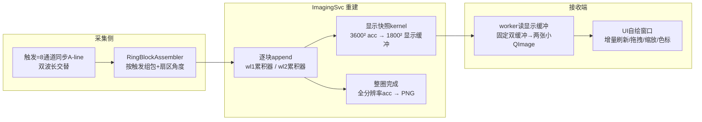

# 环扫实时成像新链路重构报告（临时会话产出，供主会话参考）

> 说明：本报告由一次临时会话整理，仅作主会话的参考上下文，不包含任何已落地的代码改动。
> 会话结束时工作区状态：HEAD = `cbbb63d`（环扫显示层方向1重构），未提交的效果调整暂存在 `stash@{0}`。

---

## 1. 背景

当前项目（MC_410T_MultiCard）在环扫实时成像中存在反复崩溃（`QList::at: index out of range`，
Qt6Core.dll 偏移 `0x6975`，异常 `0xc0000602`）。显示层已按方向1重构（cbbb63d：自绘
RingImageWidget/RingColorBarWidget 替代 QCustomPlot），但崩溃依旧复现。本次会话完成了：

- 崩溃证据链分析（重构前后签名一致、受害者随机）；
- 方向2互斥门核对；
- 线性实例（ogprog）与环扫的载荷/多通道重建差异分析；
- 仿照线性多通道重建逻辑的环扫双波长新链路重构方案。

---

## 2. 关键结论（已确认）

### 2.1 崩溃问题不在显示层，写者仍在重建/帧链路

- 重构前后 WER 签名完全相同：`Qt6Core.dll 0x6975 + 0xc0000602`（QList::at fail-fast）。
- 历史 gdb 显示受害者随机：
  - 10:05/14:48：`QCPColorGradient::colorize`（QCustomPlot 对象被写坏，`this=0x0/0x30`）；
  - 12:19：`ImagingController::frameDataToImage`（ImagingController.cpp:883，工作线程栈已损坏，
    配置为 2 通道、frameSize=12,960,000）；
  - 19:06：`QCPColorMap::draw → QPixmap`；
  - 21:26~21:58（cbbb63d 构建）：Qt6Core 内部 QList。
- 结论：显示层只是受害者/引爆点，写者位于“重建 → 帧读取/转换 → 显示投递”链路，与
  “显示开必崩、显示关不崩”的观测一致。
- 12:19 的 gdb 同时证明：即使崩溃点不在 QCustomPlot，帧工作线程本身的栈/数据也会被写坏，
  说明堆/栈越界来自重建或帧搬运侧。

### 2.2 方向2互斥门是“空转锁”，不是回退理由

- `ringDisplayGate()` 为 cbbb63d 新增，但全仓库仅 `ImagingController.cpp:426`（工作线程
  `processRingFrame`）加锁；显示侧（`ImagingDisplayWindow`）零加锁。
- 风险：不构成死锁，但注释声称“重型段与 UI 显示段互斥”实际无效；若未来有人按注释补全
  UI 侧加锁，会造成 UI 整帧阻塞及与 `m_ringFrameMutex` 的潜在锁序死锁。
- 结论：**不需要回退到重构前**（重构前显示层自身存在 QCPColorMapData 尺寸越界 bug；
  回退只会恢复旧崩溃点）。建议保留重构、删除空转锁、修复写者。

### 2.3 载荷差异量化（为什么环扫比线性大几十倍）

线性实例默认（ogprog）：nx=1200、ny=800、depth=25000~50000、move_aline=100，
单波长单帧 = 96 万 float（3.84MB）。

环扫当前默认：fov=36mm、gridSize=10μm → 3600×3600 = 1296 万 float（51.84MB）/波长，
双波长 = 103.68MB/帧。

| 项 | 线性实例 | 环扫（10μm） | 倍数 |
|---|---|---|---|
| 网格像素 | 1200×800 = 0.96M | 3600×3600 = 12.96M | 13.5× |
| 波长数 | 1 | 2 | 2× |
| 每帧字节 | 3.84MB | 103.68MB | 27× |
| 出帧节奏 | 每 move_aline=100 触发一帧 | 每块（8ch×50 触发）一帧，一圈 20 块 | 节奏差异 |
| 接收端瞬时内存 | ~15MB | ~280MB（+子进程 CUDA/SHM 后全链路 ~500MB） | ~20~30× |
| 原始采集字节 | 8ch×depth(2.5~5万)×4B ≈ 0.8~1.6MB/触发 | 8ch×sampDepth(4000)×4B = 128KB/触发 | 环扫反而低 6~12× |

结论：几十倍差异不在采集侧，而在**重建输出/显示侧**——“10μm×3600²×双波长×每块整帧回读回写”。
若线性实际也按 10μm 铺满相近范围，其单波长帧同样是 51.84MB，差距只剩双波长 2× 与出帧节奏。

### 2.4 线性与环扫多通道重建差异

| 维度 | 线性实例 | 环扫实例 |
|---|---|---|
| 阵元几何 | 8 通道线性阵列（dety≈0），全通道参与每个像素 | 8 通道圆周分布，每通道 45° 扇区，A-line 带独立角度 |
| 每触发数据 | 8×depth 一包，单波长 | 8×sampDepth，双波长交替（奇偶触发分属 532/1064） |
| 送入粒度 | 逐触发 `single_pulse_data` | 逐块（8ch×perChannelBlock 触发）`append_angles` |
| 累积位置 | pa_recon DLL 内部，接收端不可见 | CUDA d_acc/d_accW（2×3600² float，103.68MB） |
| 出帧节奏 | 累积 move_aline 触发后输出一帧 | 每块 get_state 全帧回读 + SHM 写回 + 接收端拷贝转换 |
| 重建参与 | 所有通道对所有像素 | 像素主要由覆盖扇区通道贡献，圆心附近多扇区重叠 |

核心差异一句话：**线性是“整帧低频输出”，环扫是“整帧高频输出”**。

---

## 3. 新链路重构方案（仿照线性多通道重建逻辑）

目标：实现与当前相同的实时成像视觉效果（随传感器扫描逐渐成像），同时把环扫载荷降到
线性量级，并消除已知崩溃机制。

### 3.1 数据流总览

### 3.2 详细设计

1. **触发级数据组织（沿用现有）**
   - 每触发 8 通道同步到达，`RingBlockAssembler` 按触发组包，角度按“通道扇区起点 +
     通道内行号×步进”计算；双波长按触发奇偶切分；
   - 块继续作为 CUDA 批处理单位（每块 = 8 通道 × 50 触发），避免逐触发 launch。

2. **重建侧：双波长双累积器 + 显示快照（关键改动）**
   - 每波长一个 GPU 累积器（现有 `d_acc/d_accW` 不动），逐块 `append_angles`；
   - 新增显示快照 kernel：每块从全分辨率 acc/accW 做与当前 UI 相同的块平均降采样
     （3600²→1800²，step=2），输出 1800²×2 float（25.9MB）回读，替代 103.68MB；
   - 整圈最后一块：全分辨率 acc 仅处理一次，ImagingSvc 内按现有 `frameDataToImage`
     的 min/max 归一化直接编码两张 3600² PNG。

3. **SHM 布局分离**
   - 显示区：每块更新，1800²×2×4B ≈ 25.9MB（GPU 直接出灰度可降至 6.5MB）；
   - 全分辨率区：仅整圈最后一块更新；PNG 移入子进程后此区可删除。

4. **接收端：线性式“只读最终小帧”**
   - worker 每块只读显示区，用配置时分配的固定双缓冲（A/B 显式切换）；
   - 两张 1800² 灰度 QImage 复用构建，按现有 `m_range1/m_range2` 映射；
   - 删除 `m_latestRingFrames`/`latestRingFrame` 隐式共享、每帧 2×51.84MB QVector、
     UI 侧全帧降采样、空转的 `ringDisplayGate`；
   - UI 窗口（自绘图像、拖拽、滚轮缩放、色标联动、右键范围）**不改**。

5. **视觉一致性**
   - 每块 append 后刷新显示快照，第 1~20 块逐步补全 360°，与当前逐块成像一致；
   - 显示网格与全分辨率网格同中心、同 FOV；块平均降采样语义与当前 `showRingImage` 一致；
   - 显示用窗口范围（`m_range1/2`），PNG 用自动 min/max 归一化，两种映射与现状相同。

### 3.3 载荷估算

| 环节 | 现状 | 方案后 | 降幅 |
|---|---|---|---|
| 每块 GPU→主机回读 | 103.68MB | 25.9MB | 4× |
| 每块 SHM 写 | 103.68MB | 25.9MB | 4× |
| 接收端每帧堆分配 | 2×51.84MB QVector + 2×12.96MB QImage | 固定缓冲 ~26MB | 分配归零 |
| 接收端瞬时内存 | ~280MB | ~30MB | ~9× |
| 全分辨率帧处理 | 每块一次 | 每圈一次（子进程内） | 20× |

计算侧代价：每块多一次 1800²×2 快照 kernel（约现有 3600²×2 计算的 25%），可接受。

### 3.4 实施步骤（建议顺序）

1. ImagingSvc：新增显示快照 kernel（3600² acc → 1800² 显示缓冲），SHM 增加显示区；
2. 接收端 worker：改读显示区，固定双缓冲，构建小 QImage；UI 输入接口改为小帧；
3. PNG 保存移入 ImagingSvc 整圈完成路径，移除全分辨率回传；
4. 清理 `m_latestRingFrames`、`ringDisplayGate` 等旧路径；
5. 模拟器联调验证：逐块成像视觉、色标交互、PNG 输出与现状逐像素对比。

### 3.5 风险与注意点

- 显示快照的归一化语义要与当前一致：显示用窗口范围、PNG 用自动范围，建议提取为共用映射定义；
- 先在模拟器上做“旧链路 vs 新链路”同帧比对，再进真实联调；
- 若崩溃在实施过程中仍复现，优先检查 SHM 尺寸/陈旧复用（`setupRingSharedMemory` 的
  `AlreadyExists→attach` 不校验 size/magic）与每块缓冲尺寸一致性。

---

## 4. 关键代码位置索引（供主会话参考）

- 接收端帧读取/转换：`MC_410T_MultiCard/delivery/src/ImagingController.cpp`
  - `submitRingBlock` ~287
  - `setupRingSharedMemory` ~316（陈旧 SHM attach 风险点）
  - `processRingFrame` ~419（每块 103.68MB 拷贝/转换）
  - `frameDataToImage` ~873（12:19 崩溃点 883）
- SHM 布局：`MC_410T_MultiCard/delivery/include/ImagingSharedMemory.h`
- 重建子进程：`MC_410T_MultiCard/delivery/src/ImagingSvc/ImagingSvc.cpp`
  - 线性分支 `processPulse` ~627（参照目标）
  - 环扫分支 `processRingConfigure` ~352 / `processRingPulse` ~474
- CUDA 重建：`MC_410T_MultiCard/delivery/src/RingRecon/ring_recon_cuda.cu`
- 显示窗口：`MC_410T_MultiCard/delivery/src/ImagingDisplayWindow.cpp`、`RingImageWidget.cpp`
- 线性实例源码（参照）：`ogprog/MC_410T_MultiCard/delivery/src/ImagingController.cpp`
  与 `ogprog/MC_410T_MultiCard/delivery/src/MainWindow.cpp`
- MATLAB 环扫参考：`Handoff/Ringscan_DAS_loop_realtime_dual.m`

---

## 5. 附：临时会话结论速查

- 回退：不需要（问题不在显示层，重构本身应保留）。
- 下一步：按 §3.4 实施新链路，优先做 SHM 校验与显示快照分离。
- 崩溃定位辅助：Windows WER 本地转储未启用，建议下次联调前开启 LocalDumps 或复用
  `delivery/build/udp_replay_test/` 下的 gdb 脚本抓取 Qt6Core QList::at 调用方。
