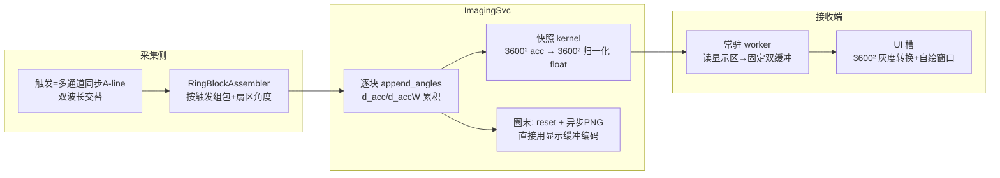

# 环扫新链路重构设计（基于《环扫新链路重构报告》）

> 关联文档：`环扫新链路重构报告.md`（临时会话产出）。
> 本设计文档供主会话实施时参照；所有步骤均按“可独立提交、可回滚”组织。

---

## 0. 报告评估结论

### 0.1 总体评价

方向正确、可执行，核心判断与证据链基本成立，可以作为重构基线。方案抓住了三个结构性
根因：大帧高频整帧回读回写（103.68MB/块）、接收端每帧堆分配与隐式共享、显示与重建
之间缺乏清晰的单所有权边界。拟定的“显示快照分离 + 固定双缓冲 + PNG 移入子进程”是对
症下药。

### 0.2 优点

1. 崩溃证据链完整：重构前后签名一致、受害者随机、12:19 gdb 定位到工作线程
   `frameDataToImage`，足以排除“问题在显示层”。
2. 载荷量化清晰：13.5×/2×/27× 的差异量化正确，并指出差异在重建输出/显示侧而非采集侧。
3. 保留现有 CUDA 累积器（d_acc/d_accW）与显示交互，改动面可控。
4. 实施顺序合理：快照先行、PNG 后移、最后清理。

### 0.3 需要修正的缺口

| # | 缺口 | 影响 | 本设计处理 |
|---|---|---|---|
| 1 | “显示开必崩、显示关不崩”与“写者在重建/帧链路”未闭环：worker 无论窗口是否显示都会跑，若“无成像”指无帧流，结论才自洽 | 影响根因表述精确性 | 新链路用固定缓冲后该问题自然消失；评估时明确前提 |
| 2 | SHM 陈旧复用（AlreadyExists→attach）只写进“风险注意”，未作为设计的强制组成部分 | 可能是独立写者/越界源 | SHM v2 + magic/version/size 强制校验，不匹配即拒绝启动 |
| 3 | 快照语义未明：若 GPU 直接出灰度，接收端将无法用右键色标范围（m_range）重映射 | 破坏现有交互 | 快照输出 acc/accW 归一化 float，接收端按 m_range 映射 |
| 4 | PNG 移入子进程后“可删除全分辨率区”过于简化：整圈仍须做一次 103MB acc→host 拷贝，且 PNG 编码不得阻塞 svc 事件循环 | 遗漏 svc 侧异步与一次回读 | 圈末异步 PNG 线程 + 有界队列；明确保留一次全分辨率回读 |
| 5 | 未发现当前 d_acc/d_accW 从不按圈清零（无 ring_recon_cuda_reset） | 跨圈累积会污染后续显示与 PNG | 新增 reset API，圈末同步清零 |
| 6 | “两张 QImage 复用构建”未定义双缓冲所有权协议，worker 覆写 QImage 时可能与 UI 绘制竞态 | 留下新的崩溃面 | 改为 float 固定双缓冲 + UI 线程小图转换（真正线性式） |
| 7 | 消息协议仍沿用 ring_frame_ready（每块整帧语义） | 语义混乱，难以区分显示刷新与整圈完成 | 拆分 ring_snapshot_ready（每块显示）/ ring_round_ready（每圈完成） |
| 8 | 实施顺序中 SHM 校验被弱化 | 若写者恰为 SHM 尺寸漂移，先做快照会带病验证 | 第 0 步先落地 SHM v2 + 校验 |

---

## 1. 设计目标与原则

### 1.1 目标

- 消除已知崩溃机制：每帧 2×51.84MB QVector 分配、跨线程隐式共享、UI 侧全帧降采样、
  空转互斥门、SHM 尺寸无校验。
- 保持实时成像视觉：逐块补全 360°、拖拽/滚轮缩放、色标联动、右键范围/自适应、
  窗口尺寸记忆与最大化适配。
- 保持整圈双波长 PNG 输出（自动 min/max 归一化，灰度黑→白）。
- 不触碰线性模式路径。

### 1.2 原则

1. **线性式主干**：重建子进程写 SHM → 接收端只读“小最终帧” → UI 线程小图转换与绘制，
   所有权单一、载荷小、尺寸先对齐再填充。
2. **固定缓冲**：所有显示缓冲配置期一次分配，运行期零堆分配。
3. **显式所有权**：双缓冲 + 原子发布，不用 Qt 隐式共享跨线程传帧。
4. **尺寸入头**：显示网格尺寸/降采样步长写入 SHM 头，两端同源。
5. **逐步落地**：每步独立提交、可回滚、可 A/B 对比。

### 1.3 方案选择（已确认：方案A）

显示图像数据**始终为全分辨率重建矩阵（3600×3600，每像素=gridSize=10μm）**，与 MATLAB
重建二维矩阵像素图像一致；屏幕物理像素只是对该矩阵的缩放渲染。因此：

- 重建累积、显示快照、PNG 全部为 3600²；
- 显示区与全分辨率区为同一区域（不另设降采样显示区）；
- 若方案A 复核不通过，回退方案B（视图缓存 1800²，仅屏幕渲染优化）。

---

## 2. 目标架构



---

## 3. SHM v2 布局（ImagingSharedMemory.h）

### 3.1 头部

```cpp
struct RingImagingShmHeader {
    uint32_t magic;          // 0x52494E47 "RING"
    uint32_t version;        // 2
    uint32_t block_seq;
    uint32_t frame_seq;      // 整圈序号
    uint8_t  block_ready;
    uint8_t  snapshot_ready; // 显示快照就绪（替代 frame_ready 的每块语义）
    uint8_t  padding[2];
    uint32_t block_size;
    uint32_t frame_size;     // 全分辨率单波长 float 数（PNG 用）
    uint16_t nx;             // 全分辨率 nx
    uint16_t ny;             // = nx
    uint32_t alines;
    uint16_t display_nx;     // 显示网格 dn
    uint16_t display_ny;     // = dn
    uint32_t display_frame_size; // dn*dn
    uint32_t snapshot_step;  // 降采样步长（与接收端同公式）
    uint32_t flags;          // bit0=PNG 可用, bit1=按圈复位启用
    uint8_t  reserved[12];
};
static_assert(sizeof(RingImagingShmHeader) == 64);
```

### 3.2 数据区（version=2）

```
[0,64)                    Header
[block]                   raw block（沿用）
[angles]                  float alines 个（沿用）
[channels]                4 字节对齐 uint8 alines 个（沿用）
[full_wl1/full_wl2]       全分辨率区（方案A：显示与 PNG 共用，不另设显示区）
```

偏移函数 `ringDisplayFramesOffset(...)` 在方案A 下等于 `ringFramesOffset(...)`
（显示区=全分辨率区），`ringImagingShmTotalSizeV2(...)` 与旧总大小一致，旧链路
读写位置完全不变。如复核不通过回退方案B（视图缓存），再把显示区改为附加区并
同步调整偏移函数。

头部字段沿用原 reserved 区域扩展（display_nx/display_ny/display_frame_size/
snapshot_step/flags），旧字段偏移不变，version 置 2。

### 3.3 创建/附接校验（强制）

`setupRingSharedMemory` 改为返回 bool，在 create/attach 后必须校验：

- `shm->size()` == 期望总大小；
- `h->magic == 0x52494E47` 且 `h->version == 2`；
- `h->nx == ceil(fov/gridSize)`、`h->display_nx == dn`、`h->block_size/alines` 与本地一致。

任一不匹配：detach、删除本对象、emit 明确错误（提示存在残留 ImagingSvc 占用旧 SHM，
需要关闭后重试），并返回 false；`startSvc` 收到 false 后**中止启动**（不建 ZMQ、
不起子进程、不发 svcReady），**不得继续使用**。

更强方案（可选）：SHM 名带会话标识（`MC_410T_RingShm_<pid>`），由 configure JSON 下发
给 svc，从根上杜绝陈旧复用。默认先做校验，如残留问题仍干扰联调再启用会话名。

---

## 4. 消息协议

| 消息 | 方向 | 时机 | 内容 |
|---|---|---|---|
| `ring_block_ready` | 接收端→svc | 沿用 | block + seq |
| `ring_snapshot_ready` | svc→接收端 | 每块 append 完成、显示区已更新 | `{seq}` |

旧 `ring_frame_ready` 与 `ring_round_ready` 已移除（第 4/5 步清理）。
协议版本与 SHM version 联动：magic/version 不匹配时双方拒绝工作。

---

## 5. ImagingSvc 侧设计

### 5.1 CUDA 新增 API（ring_recon_cuda.cu/.h）

```cpp
// 按圈清零 d_acc/d_accW（cudaMemset），m_ringBlockIndex 归零
int ring_recon_cuda_reset(void* handle);

// 快照：acc/accW → 归一化显示帧
// 方案A：step=1、dn=nx（全分辨率）；hostOut 长度 dn*dn
// 元素 = acc[i]/max(accW[i],1e-12)（与现 wlFrames 语义一致）
int ring_recon_cuda_snapshot(void* handle, int dn, int step, float* hostOut);
```

快照 kernel 细节：

- 输出像素 `(dy,dx)` = 全分辨率 `step×step` 块的归一化均值（边界块按实际像素数平均，
  与现 `showRingImage` 的 cnt/break 逻辑一致；方案A 下 step=1，即逐像素归一化）；
- 归一化在 kernel 内完成，输出 float，**不输出灰度**（保留接收端 m_range 重映射）；
- host 每块回读 2×nx²×4B（方案A：103.68MB）。

### 5.2 processRingPulse 改造

```
1. 读取 block/angles/channels（沿用）
2. 预处理 + append_angles（沿用）
3. 双波长各调 ring_recon_cuda_snapshot(nx, 1, m_ringDisplay0/1.data())
4. 锁 SHM → 写全分辨率区（=显示区）→ 解锁
5. sendRingSnapshotToHost()
6. if (++m_ringBlockIndex % blocksPerFrame == 0):
     ring_recon_cuda_reset(双波长)   // m_ringDisplay0/1 已持有本圈完整归一化帧
```

### 5.3 PNG 保存（已移至接收端窗口，见 §8）

### 5.4 配置校验

processRingConfigure 在写入 m_ringFrameSize 的同时计算并保存：

```cpp
// 方案A：显示=全分辨率
m_displayStep = 1;
m_displayDn   = nx;
m_displayFrameSize = nx * nx;
```

并校验 SHM 头 version/display 字段与本地一致（不匹配拒绝）。

---

## 6. 接收端设计（ImagingController + MainWindow）

### 6.1 删除项

- `m_latestRingFrames[2]` / `latestRingFrame()` / `ringFrameNx()`（显示用途）；
- `processRingFrame` 的 2×51.84MB QVector 分配与 103.68MB memcpy；
- `ImagingDisplayWindow::showRingImage` 的全帧降采样与 `m_ringBuf1/2`；
- `ringDisplayGate()` 空转锁；
- 接收端 `saveFinalRingImages`（或保留为过渡期回退路径）。

### 6.2 固定双缓冲

```cpp
// ImagingController 成员（configureRing 时一次分配；方案A：3600²×2 float = 103.68MB）
std::vector<float> m_dispBuf[2];   // 各 nx²*2 float
std::atomic<int>   m_dispActive{-1};
std::atomic<int>   m_dispSeq[2];        // 各缓冲的帧序号
std::atomic<bool>  m_dispConsumed[2];   // UI 读完置 true，worker 写入前取反
```

所有权协议：

- worker 选 `target = active<0 ? 0 : 1-active`，`m_dispConsumed[target].exchange(false)`
  成功（原为 true）才写；失败说明 UI 仍在读，直接丢弃本快照（latest-wins）；
- worker 写数据 → `m_dispSeq[target]`（release）→ `m_dispActive`（release）；
- UI 槽按信号携带的 (seq, bufferIndex) 读对应缓冲（acquire 校验序号），
  使用完必须 `m_dispConsumed[index].store(true, release)`，否则 worker 后续全部丢帧；
- 被发布缓冲在 UI 消费前不会被覆写（consumed 握手），杜绝读写竞态；
- 尺寸变化（nx 变化）时先停止 worker、重新分配、再恢复。

### 6.3 worker 改造

`ringWorkerLoop` 处理 `ring_snapshot_ready`：

```
1. 锁 SHM；校验 h->display_nx/display_frame_size 与本地一致；
2. memcpy 显示区 → m_dispBuf[inactive]（nx²*2*4B，固定目标，无分配）；
3. 解锁；release 发布 inactive 为 active；带 seq；
4. invokeMethod(UI, [seq]{ emit ringSnapshotReady(seq); })
```

### 6.4 UI 槽改造（MainWindow）

`ringSnapshotReady` 槽（UI 线程）：

1. 读 active 缓冲（acquire）；
2. 用 `m_range1/m_range2` 逐像素构建两张 3600×3600 灰度 QImage（12.96M 像素/波长，
   方案A 性能风险点，预计数十毫秒级；复核不通过则回退方案B）；
3. `m_imagingDisplayWindow->showRingImage(img1, img2, seq)`（新接口，见 §7）；
4. 更新状态栏帧计数/进度。

### 6.5 停止/重启

- `finishStopSvc` 保持先停 worker 再释放 SHM 的顺序；
- 自动重启（ringConfigChangedWhileRunning）路径不变，dn 变化时双缓冲重建；
- 新增 SHM 校验失败时不得进入 feed 状态，UI 给出明确错误。

---

## 7. 显示窗口接口调整（ImagingDisplayWindow）

```cpp
// 新接口：只接收全分辨率 QImage（方案A）
void showRingImage(const QImage &img1, const QImage &img2, int seq);
```

- 删除 `showRingImage(QVector<float>...)`、`renderGrayImage`、`m_ringBuf1/2`、
  `m_lastDn` 动态尺寸逻辑；
- 保留：RingImageWidget（拖拽/滚轮/右键）、RingColorBarWidget、窗口尺寸记忆、
  最大化适配、色标上下沿对齐、灰色背景一体；
- `m_range1/2` 的修改（右键范围/自适应）继续作用于 UI 槽下一次转换；
  即时重绘当前帧的需求由 UI 槽保存当前浮点帧满足（推荐：显示窗口缓存最近一张
  nx²×2 float，右键改范围时按缓存 float 重算，不依赖上游重发）。

---

## 8. PNG 保存链路

已实现（第 4 步，保存点互斥：圈末重置 或 超时重置，一次只触发其一）：

```
触发点1 圈末重置：svc 完成一整圈最后一块 → 接收端 seq % blocksPerFrame == 0
触发点2 超时重置：接收端 250ms 定时器检测空闲超时到点 → 立即保存当前窗口 PNG
  （不等新触发；新触发到来时组包器再发 ring_reset 清空重建）
  → 用实时成像窗口当前缓存帧（m_ringBuf1/2）+ 当前手动/自适应色标范围（m_range1/2）
  → 块平均降采样渲染 1600×1600 ARGB32 → 双波长 PNG（_532nm/_1064nm）
```

- 保存内容与窗口显示一致（含手动调整的色标范围），不额外归一化；
- 输出 1600×1600、32 位（ARGB32）PNG，块平均降采样提高精度；
- 文件名沿用：数据保存框后缀 + 时间戳 + frameN + 波长标签；
- svc 侧不再保存 PNG（已移除第 4 步初版的 svc 异步保存与 ring_round_ready）。

---

## 9. 清理清单

已完成（第 3~5 步）：

- `ImagingController.h/.cpp`：latestRingFrame、ringFrameNx、ringDisplayGate、
  每块 100MB QVector、ringImageReady、旧 ring_frame_ready 路由均已移除；
- `ImagingDisplayWindow`：全帧接口与降采样已移除，改为全分辨率小接口；
- `MainWindow`：saveFinalRingImages/ringImageReady 已移除，保存改窗口级触发；
- `ImagingSvc`：sendRingFrameToHost/ring_round_ready/保存线程已移除；
- `ImagingSharedMemory.h`：旧 ringImagingShmTotalSize 与方案B降采样辅助已删除；
- 诊断文件：rspdiag.log/ring_diag_log.txt 等已确认无残留。

---

## 10. 实施步骤（每步独立提交）

| 步骤 | 内容 | 验证 |
|---|---|---|
| 0 | SHM v2 布局 + 强校验（仅新增，旧链路不动；失败中止启动） | 正常启动通过；伪造 size/version/残留 v1 SHM 被拒且启动中止 |
| 1 | CUDA：snapshot + reset API（含 verify 自检：snapshot==get_state 归一化、reset 后全零） | ring_recon_cuda_verify 通过 |
| 2 | svc：快照写全分辨率区 + ring_snapshot_ready + 圈末 reset（暂不加 PNG；保留 ring_frame_ready 供 A/B） | 模拟器逐块显示与旧链路一致 |
| 3 | 接收端：固定双缓冲 + 新 UI 接口；保留旧路径开关 A/B | 新旧同帧 diff；交互回归 |
| 4 | PNG 保存移至接收端窗口（圈末/超时到点触发，1600×1600 ARGB32） | 窗口内容=PNG 内容；两触发点各存两张 |
| 5 | 清理旧路径（ring_frame_ready/旧SHM函数/方案B辅助/死代码） | 全量回归 + 长时压测 |

---

## 11. 验证方案

1. **单元**：snapshot 数值 = CPU 平均 ± 1e-6；reset 后 get_state 全零；
   SHM v2 校验正反例。
2. **A/B 联调**：模拟器同一输入下，旧链路 vs 新链路逐块显示图 diff（≤1 LSB）；
   色标右键范围/自适应行为一致。
3. **交互回归**：拖拽、滚轮、最大化/还原、窗口尺寸记忆、色标上下沿对齐。
4. **PNG 对比**：新 svc PNG 与旧接收端 PNG 逐像素 diff。
5. **稳定性**：连续多圈压测；固定缓冲首尾 canary（每帧校验 magic）检测越界写；
   PageHeap/gdb 脚本保留，联调崩溃时可抓 Qt6Core QList::at 调用方。
6. **回归**：线性模式不受影响（本设计不触碰线性分支）。

---

## 12. 风险与回退

| 风险 | 缓解 |
|---|---|
| 快照语义与旧 UI 降采样有像素级差异 | A/B diff + 边界平均公式对齐 |
| svc PNG 编码阻塞事件循环 | 异步线程 + 有界队列 + 积压丢弃策略 |
| 协议/SHM 版本不匹配 | magic/version 强校验 + 明确错误提示 |
| 双缓冲发布竞态 | release/acquire 原子 + 序号校验 + canary |
| 实施中途崩溃仍复现 | 步骤 0/2 先独立验证 SHM 与写者；每步可回退 |
